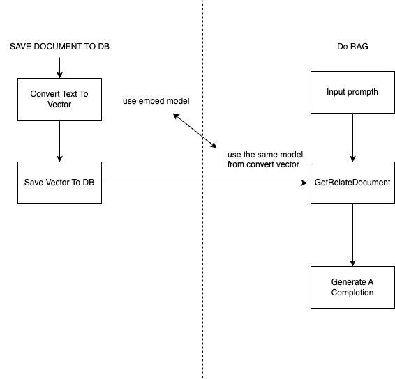

# letsRAG

This repository is a Proof of Concept (POC) on how to perform basic Retrieval-Augmented Generation (RAG).

## Demo

[Watch the demo video on YouTube](https://www.youtube.com/watch?v=kvcqdqZHmQ8)
